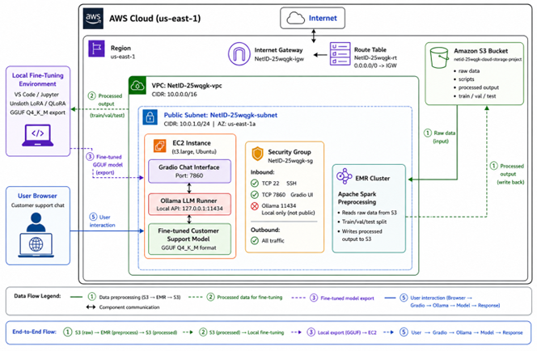

# AWS Customer Support Fine-Tuning

End-to-end cloud-based customer support chatbot project using AWS, EMR, Terraform, Unsloth QLoRA, Ollama, and Gradio.

## Overview

This project demonstrates a complete cloud ML workflow for fine-tuning and deploying a customer support chatbot. The pipeline includes infrastructure provisioning with Terraform, data preprocessing with Apache Spark on Amazon EMR, fine-tuning Qwen2.5-3B-Instruct using Unsloth QLoRA, exporting the model to GGUF format, and deploying it on an AWS EC2 CPU instance with Ollama and a Gradio web interface.

## Tech Stack

- AWS EC2
- AWS EMR
- Amazon S3
- Terraform
- Apache Spark / PySpark
- Unsloth
- QLoRA / LoRA
- Qwen2.5-3B-Instruct
- GGUF / llama.cpp
- Ollama
- Gradio
- Python

## Architecture

Raw customer-support data was stored in Amazon S3 and preprocessed using Apache Spark on EMR. The processed train, validation, and test splits were used to fine-tune `unsloth/Qwen2.5-3B-Instruct-bnb-4bit` with QLoRA. The fine-tuned model was exported to GGUF Q4_K_M format and deployed on an EC2 `t3.large` instance using Ollama. A Gradio web interface was hosted on the same instance and connected to the local Ollama API.




## Repository Contents

```text
README.md
main.tf
preprocessing_optimized.py
chatbot_fine_tuning_completed.ipynb
api_runner.py
web_ui.py
Project Workflow
Provisioned AWS infrastructure using Terraform.
Uploaded the raw Bitext customer-support dataset to Amazon S3.
Ran PySpark preprocessing on Amazon EMR.
Fine-tuned Qwen2.5-3B-Instruct using Unsloth QLoRA.
Exported the fine-tuned model to GGUF Q4_K_M format.
Deployed the GGUF model on EC2 using Ollama.
Built a browser-based Gradio chatbot interface.
Notes

Large model artifacts, datasets, virtual environments, GGUF files, adapter folders, and AWS private keys are not included in this repository.
